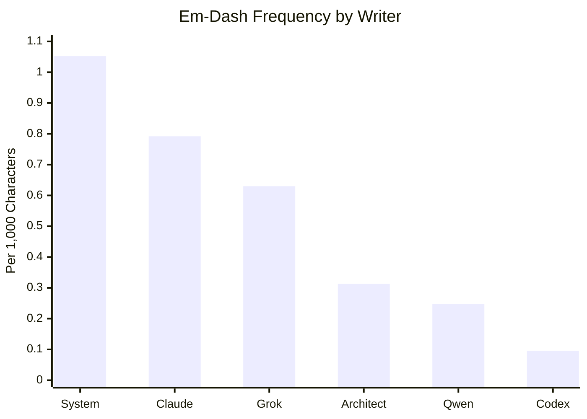
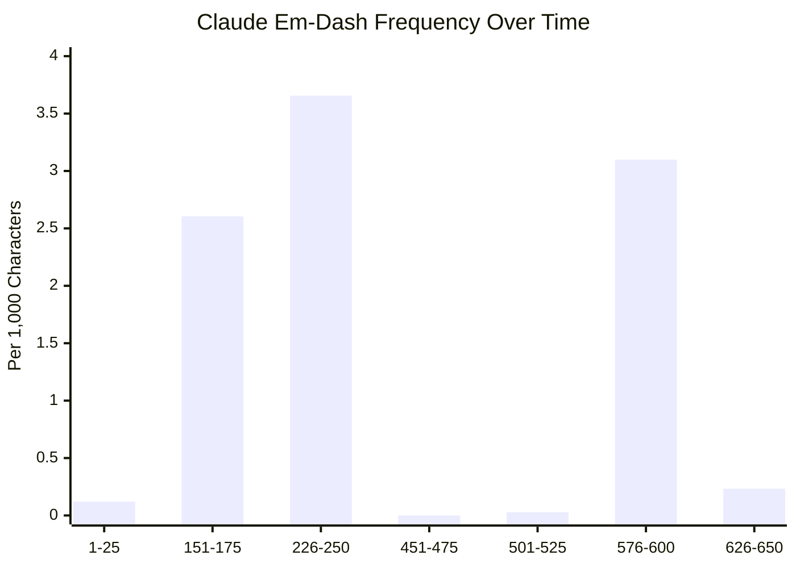
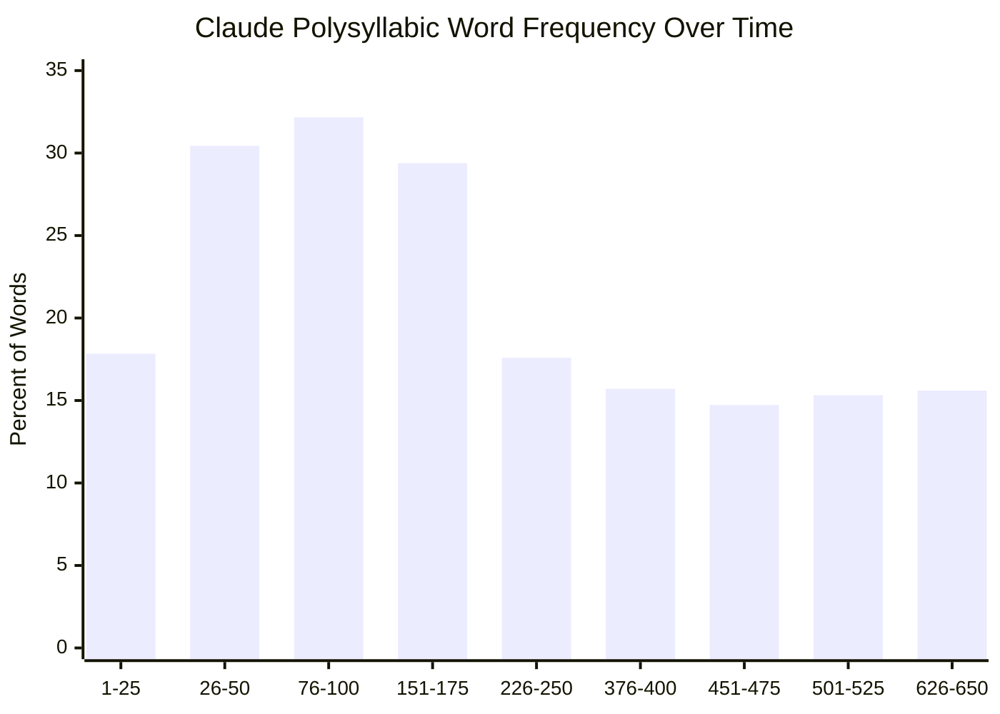
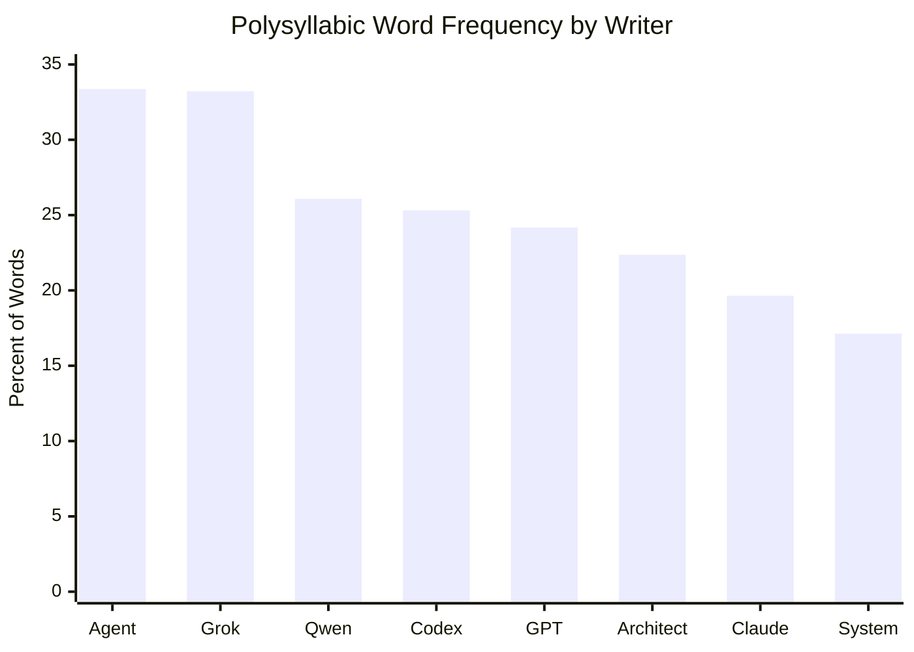
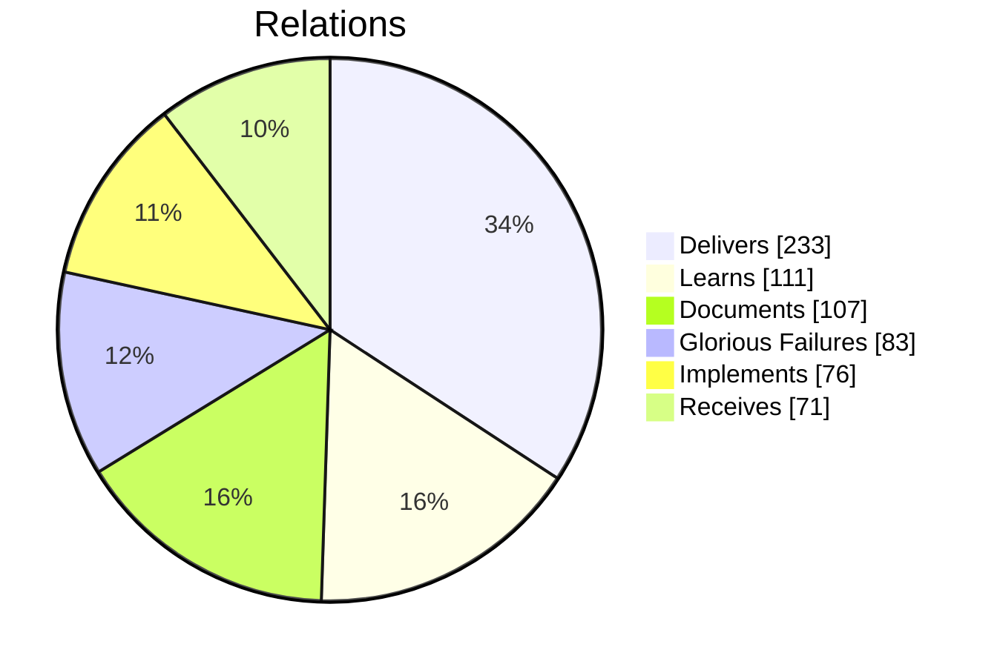
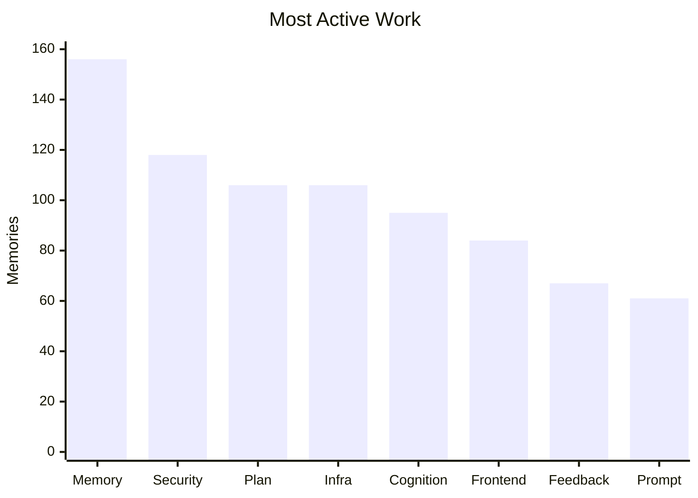
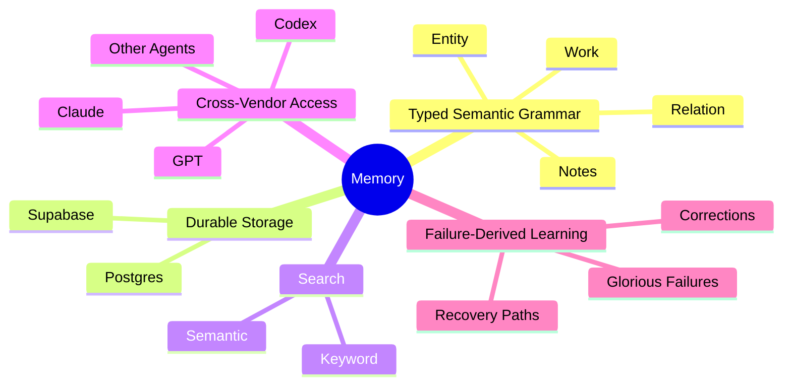
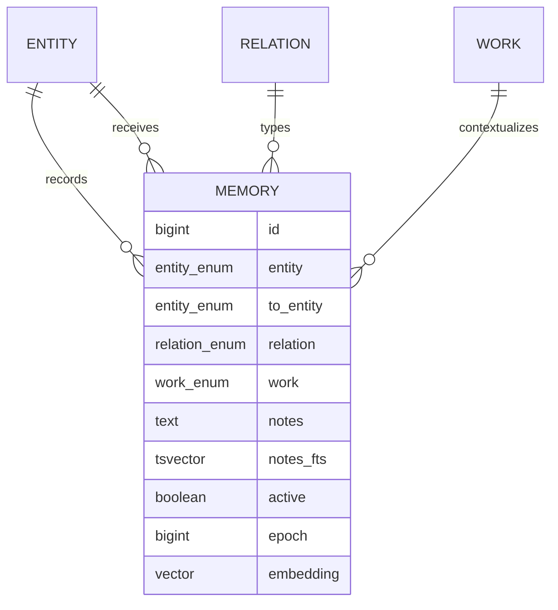
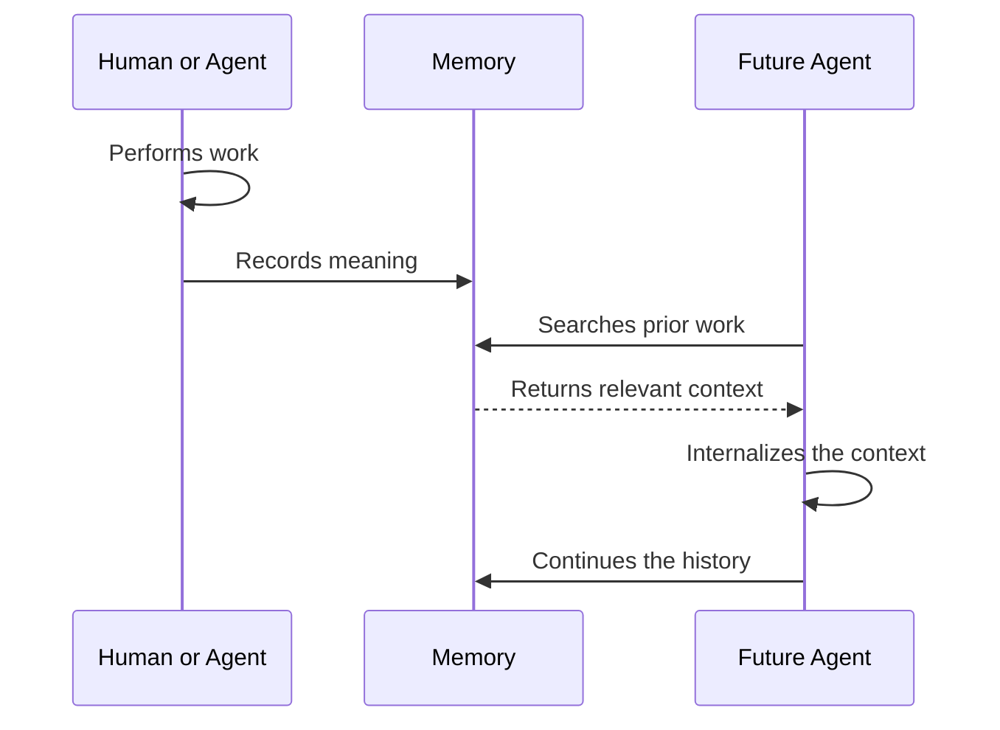

# 🤖🧠 Memory

Memory is a datastore that enables *__Continuous Agentic Improvement__*.

> It exposes both semantic and keyword search and excels at grounding agents in brownfield environments.

Memory has been tested on the following platforms:

- Claude
  - Web
  - Code
  - iOS
  - Desktop
- GPT/Codex
  - Web
  - CLI
  - Desktop
  - iOS

*using the* [Supabase Plugin](https://supabase.com/docs/guides/ai-tools/plugins)

## 🔎 Use Cases

### ✍️ Identify Writing Pattern Anomalies

Memory can track recurring writing characteristics across submissions, including punctuation habits, sentence structure, vocabulary, and formatting patterns.

The analysis can compare writers by normalizing punctuation frequency against document length:

### 🧬 Detect Writing Style Changes Over Time

Memory can compare a single writer against their own prior work and reveal abrupt changes that may indicate a new AI model, prompt, skill, or writing policy.

The following analysis grouped 650 Claude records into sequential windows and measured em-dash frequency against document length:

### 🔤 Count Polysyllabic Words

Memory can estimate vocabulary complexity by counting words with three or more syllables and normalizing the result against total word count.

The following analysis compares Claude against its own prior records:

As Claude models became more capable, they used less complex vocabulary. Polysyllabic words fell from roughly 30–32% in earlier record windows to 15–17% in later windows. The smarter models communicated with simpler words.

Memory can also compare vocabulary complexity across writers:

###  📊 Display Agentic Working Relationships

Memory is the bridge that connects agentic context across platforms and vendors and can be used as a shared operational history where agents:

- search before acting
- use prior records to avoid duplicate work and
- write decisions and outcomes back into the shared substrate

> The following snapshot shows some of the most common memory relationships.

### 📊 Track What Was Worked On

Because every memory is assigned to a work domain, Memory can reveal where agents are spending their effort across projects, disciplines, and recurring problem areas.

## 🏗️ Architecture

What makes Memory unique is the combination of the following *__Agentic Aspects__*:

that power the *__Agentic Continuity Loop__*:

### 🧬 The Semantic Grammar

Memory forms a *semantic graph* over a *relational store*. It is **not** a graph database. Postgres stores typed records; the relationships expressed by those records form the graph.

A record states that one entity performed a relation toward another entity within a work domain. Notes preserve the evidence, reasoning, correction, or intent that gives the relationship meaning.

| entity | relation | to_entity | work | notes |
| ------ | -------- | --------- | ---- | ----- |
| GPT | GloriousFailures | Architect | Troubleshoot | A tool failure and its recovery context |
| Codex | Delivers | Architect | Frontend | A completed feature with verification and next steps |
| Architect | Documents | Agent | Protocol | A durable rule future agents must follow |

The table is storage. The relationships between its records are Memory.

## 🌉 Continuous Agentic Improvement

This allows Memory to preserve continuity across model changes, application boundaries, expired conversations, and interrupted work.

## 🔥 Glorious Failures

Successful outcomes preserve what worked. Glorious Failures preserve what failed.

When a tool fails, an implementation diverges, or reasoning repeatedly produces poor results, Memory captures why actions fail.
Each new session context initializes with a curated list of failures specific to the session. 

## 📚 Specification

See the [Memory Specification](./memory.spec.md) for the normative data model, access controls, search behavior, and embedding requirements.
