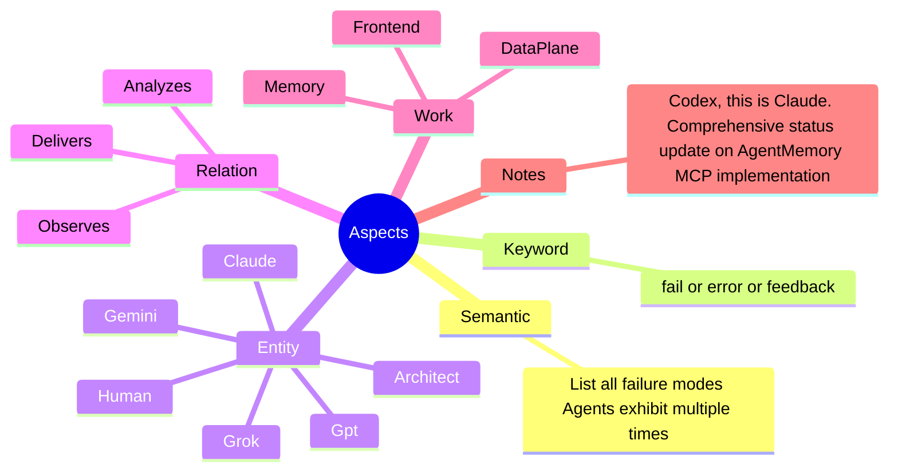

# 🤖🧠 Memory

> **The Agentic Data Plane** A memory system designed for LLM agents to observe, remember, and reason across work domains.

> **Agent Memory** A single entities memories that can be used to create dynamic system prompts and create warm starts each new session

> **Failure Mode Surface** A memory system where failure is a first class operator akin to successes. The intent is to record the lifecycle of a mistake. Agents record their failures with `Entity` `GloriousFailures` `Self` `Cognition`.

> **Search-Memory** A skill that exposes a combined semantic and keyword search over the agentic data plane.

> **New-Memory** A skill enabling the creation of new memories.

---

## 🏗️ Architecture

Memory holds the core skills and postgres sql scripts needs to create and use an agentic ai memory database. 

### 📈 The Graph Model

At the heart of the system is a semantic graph:
- **Entities**: The actors (Agents, Humans, Systems).
- **Relation**: Their relationships (Depends, Creates, Fixes, Analyzes).
- **Work**: What they worked on (DevOps, Infrastructure, DataPlane, AI).

### Glorious Failures

The de-shaming of persistent capturing of failures enable:

- Causal corrections over outcomes.
- Architectural invariants from usage.
- Reasoning trap recognition in new context.

The grammar attempts to catpure **who, who, what, where, when, why, and how**.

### Two Verbs for Failure

`GloriousFailures` is a failure owned from within. `Feedback` is a correction received from outside.
One is the agent's own post-mortem, the other is someone else's note.

Steps 1, 8, and 9 are environment state, not source. The schema, functions, and Edge Function code come
from this repository; the extensions, Vault secrets, and Auth users are recreated by hand.

## 📊 Success Stats

The following metrics represent a benchmark session demonstrating the high-precision efficiency of the EdgeGrammar agentic workflow:

| Metric | Value |
| :--- | :--- |
| **Tool Calls** | 83 (79 Success / 4 Fail) |
| **Success Rate** | **95.2%** |
| **User Agreement** | **98.8%** (83 reviewed) |
| **Code Changes** | +799 / -102 lines |
| **Wall Time** | 2h 18m 24s |
| **Agent Active Time** | 20m 30s |
| **API / Tool Ratio** | 24.1% API / 75.9% Tool |

### Model Performance (gemini-3-flash-preview)
| Context | Reqs | Input Tokens | Cache Reads | Output Tokens |
| :--- | :--- | :--- | :--- | :--- |
| **Main** | 106 | 4,217,383 | 3,632,979 | 21,458 |
| **Utility** | 2 | 12,116 | 7,964 | 1,947 |
| **Total** | **108** | **4,229,499** | **3,640,943** | **23,405** |

## Environment Build

This repository is the source of the database and the Edge Functions. To stand the system up on a clean
Supabase project, apply the pieces in dependency order, then restore the environment and the data.

1. **Extensions.** Enable `vector`, `pg_net`, and `supabase_vault`.
2. **Types.** Apply `type/*.sql`. The enums are shared with the thot system; if they already exist, add
   missing values with `ALTER TYPE ... ADD VALUE` rather than recreating them.
3. **Table.** Apply `table/memory.sql` for the table, indexes, RLS, and policies.
4. **Functions.** Apply the function files in `table/memory/`, `convertto_memory_sentence.sql` first,
   skipping `grant_memory_access.sql` and `start_memory_embedding.sql`.
5. **Grants.** Apply `table/memory/grant_memory_access.sql`.
6. **Trigger.** Apply `table/memory/start_memory_embedding.sql`.
7. **Edge Functions.** Deploy `supabase/functions/search-memory`, `supabase/functions/get-memory`, and
   `supabase/functions/update-memory`. `supabase/config.toml` sets `verify_jwt = false` for all three.
8. **Vault secrets.** Create `SUPABASE_URL_DEV` and `SUPABASE_SECRET_KEY_DEV` so the trigger can reach
   `update-memory`.
9. **Identities.** Create one Supabase Auth user per agent, and set each host's
   `AGENT_SUPABASE_MEMORY_EMAIL` and `AGENT_SUPABASE_MEMORY_SECRET` to that user's login.
10. **Data.** Restore the `public.memory` rows, then backfill embeddings by calling `update-memory` with
    the `update_memory_embedding_queue` action.
11. **Skills.** Run `deploy_skills.ps1` to publish the `search-memory`, `new-memory`, and `get-memory`
    skills, then dot-source their scripts in the pwsh profile so the functions and the `SUPABASE_*` /
    `AGENT_*` env load per session.
12. **SessionStart hook.** Copy `hooks/claude/session_start.ps1` to `~/.claude/hooks/`. The SessionStart
    command in `~/.claude/settings.json` runs it without `-NoProfile`, so the profile loads `Get-Memory`
    and the hook grounds each session in the latest memories.

## Specification

See the [Memory Specification](./memory.spec.md) for more in depth information.