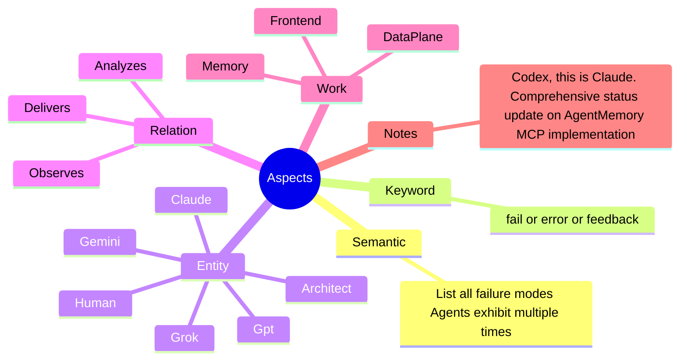

# Memory

> **The Agentic Data Plane** A memory system designed for LLM agents to observe, remember, and reason across work domains.

> **Agent Memory** A single entities memories that can be used to create dynamic system prompts and create warm starts each new session

---

## 🏗️ Architecture

Memory holds the core skills and postgres sql scripts needs to create and use a memory database. 

### The Graph Model

At the heart of the system is a semantic graph:
- **Entities**: The actors (Agents, Humans, Systems).
- **Edges**: The relationships (Depends, Creates, Fixes, Analyzes).
- **Work Domains**: The context (DevOps, Infrastructure, DataPlane, AI).

## 📊 Success Statistics

The following metrics represent a benchmark session demonstrating the high-precision efficiency of the EdgeGrammar agentic workflow:

| Metric | Value |
| :--- | :--- |
| **Tool Calls** | 83 (79 Success / 4 Fail) |
| **Success Rate** | **95.2%** |
| **User Agreement** | **98.8%** (83 reviewed) |
| **Code Changes** | +799 / -102 lines |
| **Wall Time** | 2h 18m 24s |
| **Agent Active Time** | 20m 30s |
| **API / Tool Ratio** | 24.1% API / 75.9% Tool |

### Model Performance (gemini-3-flash-preview)
| Context | Reqs | Input Tokens | Cache Reads | Output Tokens |
| :--- | :--- | :--- | :--- | :--- |
| **Main** | 106 | 4,217,383 | 3,632,979 | 21,458 |
| **Utility** | 2 | 12,116 | 7,964 | 1,947 |
| **Total** | **108** | **4,229,499** | **3,640,943** | **23,405** |

### Specification

See the [Memory Specification](./memory.spec.md) for more in depth information.