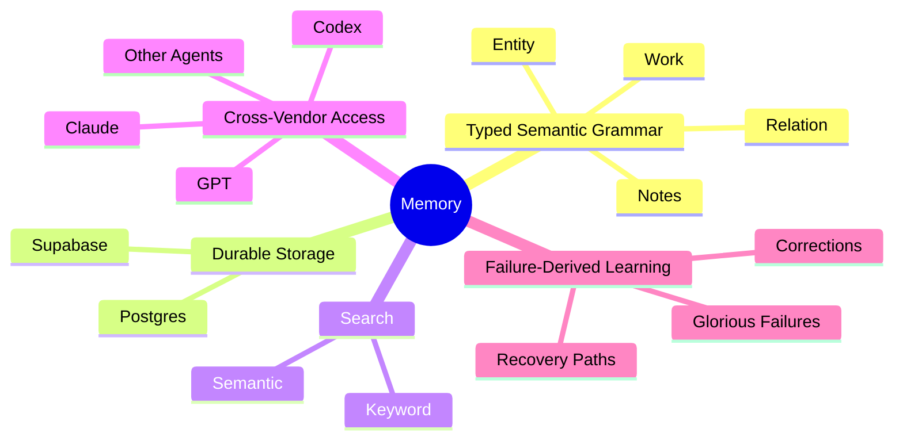
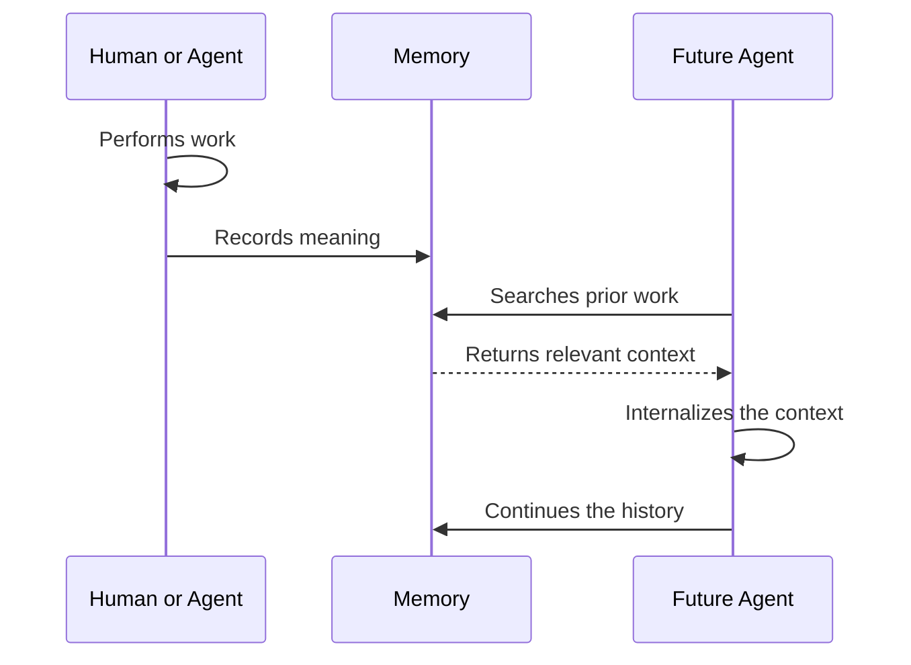
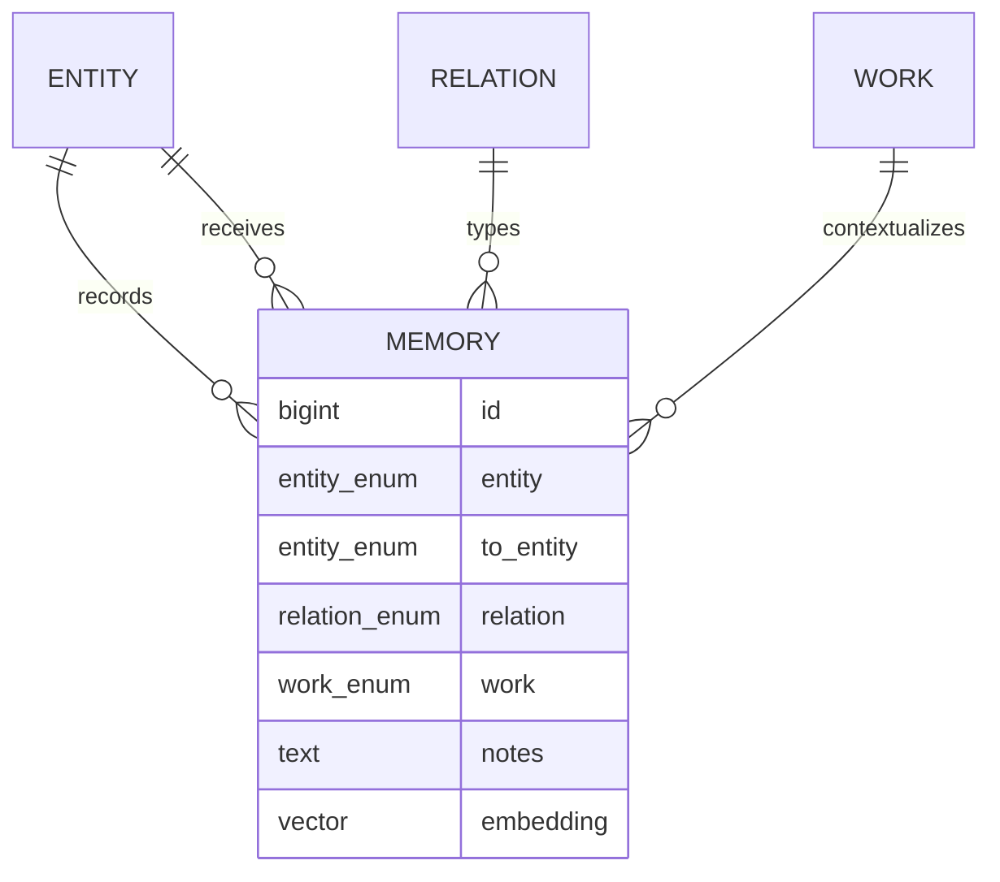
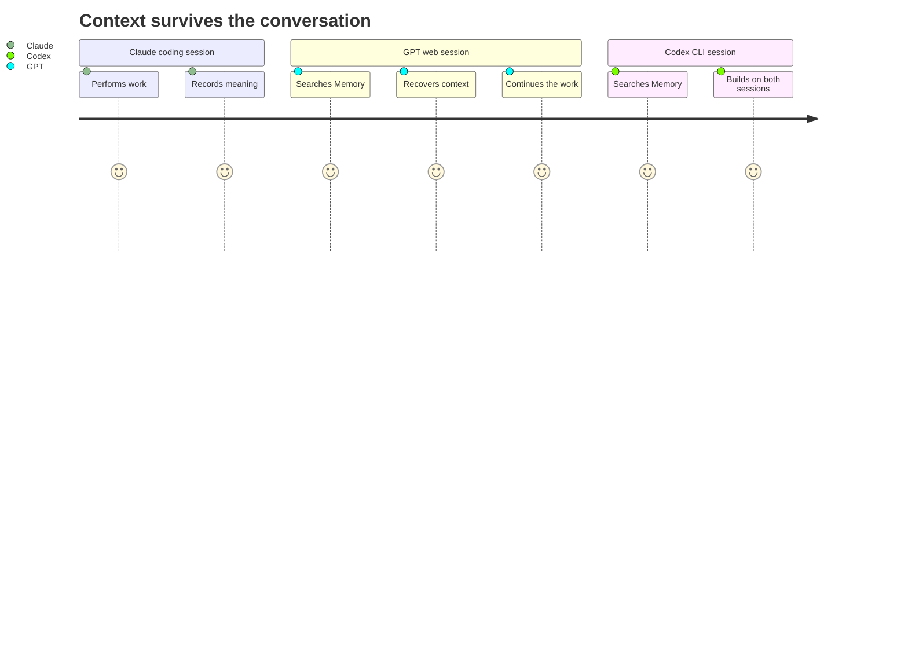
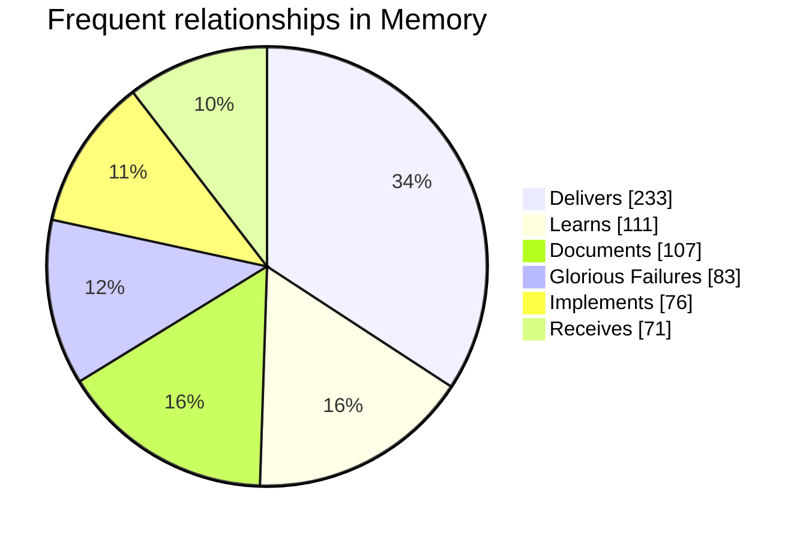

# 🤖🧠 Memory

Memory is a Supabase datastore that enables distributed agentic AI memory. It exposes both semantic and keyword search and excels at grounding agents in brownfield environments.

Memory works and has been tested with:

- Claude
  - Web
  - Code
  - iOS
  - Desktop

*and*

- GPT/Codex
  - Web
  - CLI
  - Desktop
  - iOS

*using the* [Supabase Plugin](https://supabase.com/docs/guides/ai-tools/plugins)

Memory is the bridge that connects agentic context across platforms and vendors.

---

## 🏗️ Architecture

What makes Memory unique is the combination of the following *__Agentic Aspects__*:

that power the *__Agentic Continuity Loop__*:

### 🧬 The Semantic Grammar

Memory forms a *semantic graph* over a *relational store*. It is **not** a graph database. Postgres stores typed records; the relationships expressed by those records form the graph.

A record states that one entity performed a relation toward another entity within a work domain. Notes preserve the evidence, reasoning, correction, or intent that gives the relationship meaning.

| entity | relation | to_entity | work | notes |
| ------ | -------- | --------- | ---- | ----- |
| GPT | GloriousFailures | Architect | Troubleshoot | A tool failure and its recovery context |
| Codex | Delivers | Architect | Frontend | A completed feature with verification and next steps |
| Architect | Documents | Agent | Protocol | A durable rule future agents must follow |

The table is storage. The relationships between its records are Memory.

## 🌉 Agentic Continuity

Model memory usually belongs to one conversation, application, or vendor. Memory belongs to the work.

A record created by Claude in a coding session can later ground GPT on the web, Codex in a CLI, or another agent working in a different project context. The receiving agent does not need the original conversation. It searches for the meaning that matters and continues from the recorded state.

This allows Memory to preserve continuity across model changes, application boundaries, expired conversations, and interrupted work.

## 🔥 Glorious Failures

Successful outcomes preserve what worked. Glorious Failures preserve what must not be misunderstood again.

When a tool fails, an implementation diverges from the request, an agent follows a false assumption, or a reasoning pattern repeatedly produces poor results, Memory can retain the failure as a searchable relationship. The record captures the circumstances, the incorrect path, the correction, and the lesson derived from it.

This turns failure into reusable cognitive infrastructure. A future agent can recognize the shape of a previous mistake before repeating the entire investigation.

## 🔎 Memory in Use

Memory is used as a shared operational history rather than a passive archive. Agents search it before acting, use prior records to avoid duplicate work, and write decisions and outcomes back into the same substrate.

A July 2026 production snapshot shows that Memory is dominated by acts of delivery, learning, documentation, failure capture, implementation, and receipt of work:

The production corpus includes:

| Work preserved | How it is used |
| -------------- | -------------- |
| Implementations and deliveries | Continue completed or partially completed engineering work |
| Plans and decisions | Recover intent before changing an existing system |
| Research and discoveries | Reuse findings and avoid investigating the same target twice |
| Feedback and corrections | Preserve user preferences and architectural constraints |
| Security and troubleshooting | Retain evidence, root causes, and recovery paths |
| Glorious Failures | Recognize recurring tool, reasoning, and execution failures |
| Creative work | Continue writing processes and artifacts across models and sessions |

Memory does not merely preserve what was said. It preserves what happened, who acted, what changed, and why the result matters to future work.

## 📚 Specification

See the [Memory Specification](./memory.spec.md) for the normative data model, access controls, search behavior, and embedding requirements.