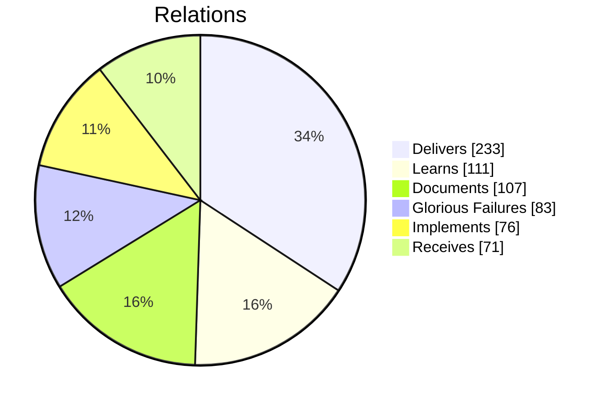
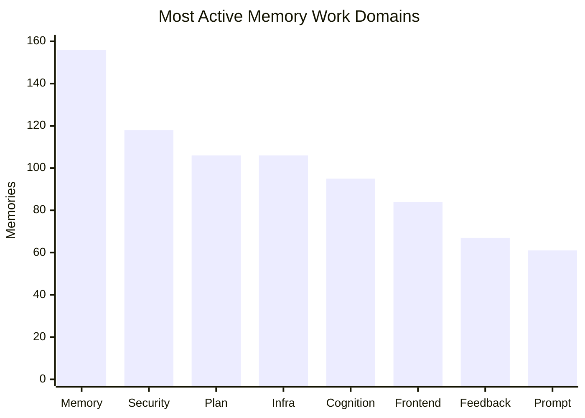
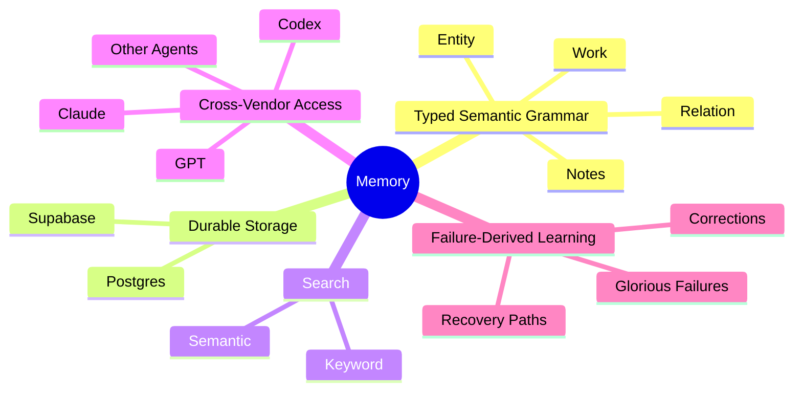
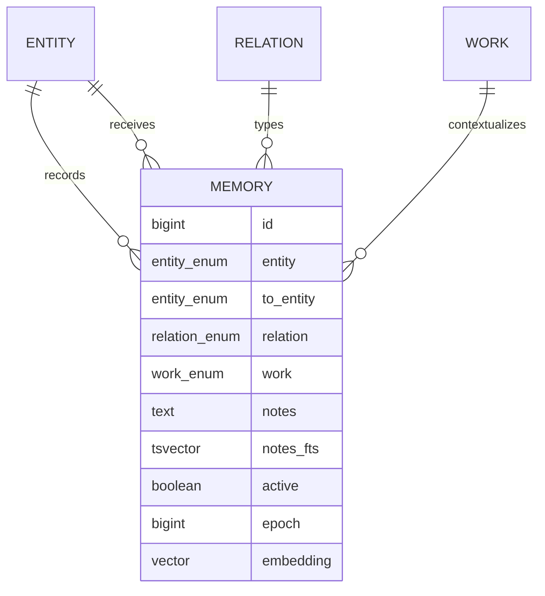
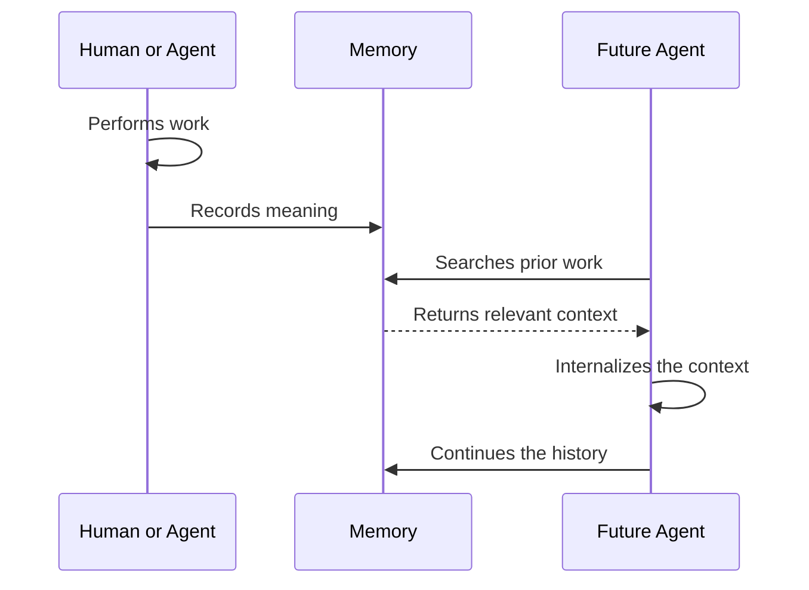

# 🤖🧠 Memory

Memory is a datastore that enables continuous agentic improvement.

> It exposes both semantic and keyword search and excels at grounding agents in brownfield environments.

Memory works and has been tested with:

- Claude
  - Web
  - Code
  - iOS
  - Desktop
- GPT/Codex
  - Web
  - CLI
  - Desktop
  - iOS

*using the* [Supabase Plugin](https://supabase.com/docs/guides/ai-tools/plugins)

## 🔎 Use Cases

###  Display Agentic Working Relationships

Memory is the bridge that connects agentic context across platforms and vendors and can be used as a shared operational history where agents:

- search before acting
- use prior records to avoid duplicate work and
- write decisions and outcomes back into the shared substrate

> The following snapshot shows some of the most common memory relationships.

### 📊 Track What Was Worked On

Because every memory is assigned to a work domain, Memory can reveal where agents are spending their effort across projects, disciplines, and recurring problem areas.

## 🏗️ Architecture

What makes Memory unique is the combination of the following *__Agentic Aspects__*:

that power the *__Agentic Continuity Loop__*:

### 🧬 The Semantic Grammar

Memory forms a *semantic graph* over a *relational store*. It is **not** a graph database. Postgres stores typed records; the relationships expressed by those records form the graph.

A record states that one entity performed a relation toward another entity within a work domain. Notes preserve the evidence, reasoning, correction, or intent that gives the relationship meaning.

| entity | relation | to_entity | work | notes |
| ------ | -------- | --------- | ---- | ----- |
| GPT | GloriousFailures | Architect | Troubleshoot | A tool failure and its recovery context |
| Codex | Delivers | Architect | Frontend | A completed feature with verification and next steps |
| Architect | Documents | Agent | Protocol | A durable rule future agents must follow |

The table is storage. The relationships between its records are Memory.

## 🌉 Continuous Agentic Improvement

This allows Memory to preserve continuity across model changes, application boundaries, expired conversations, and interrupted work.

## 🔥 Glorious Failures

Successful outcomes preserve what worked. Glorious Failures preserve what must not be misunderstood again.

When a tool fails, an implementation diverges from the request, an agent follows a false assumption, or a reasoning pattern repeatedly produces poor results, Memory can retain the failure as a searchable relationship. The record captures the circumstances, the incorrect path, the correction, and the lesson derived from it.

This turns failure into reusable cognitive infrastructure. A future agent can recognize the shape of a previous mistake before repeating the entire investigation.

## 📚 Specification

See the [Memory Specification](./memory.spec.md) for the normative data model, access controls, search behavior, and embedding requirements.
