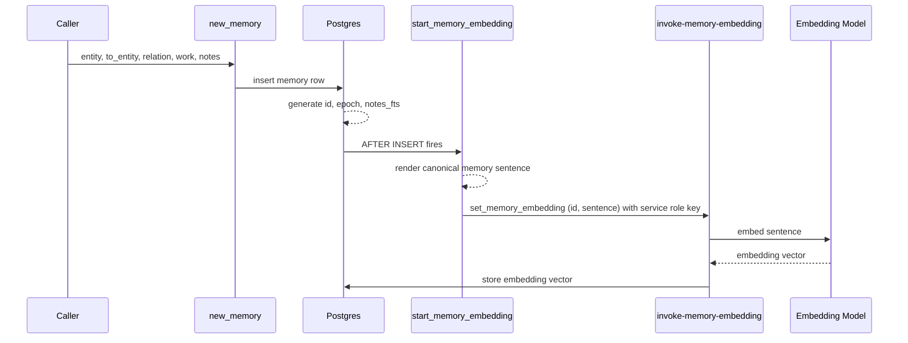
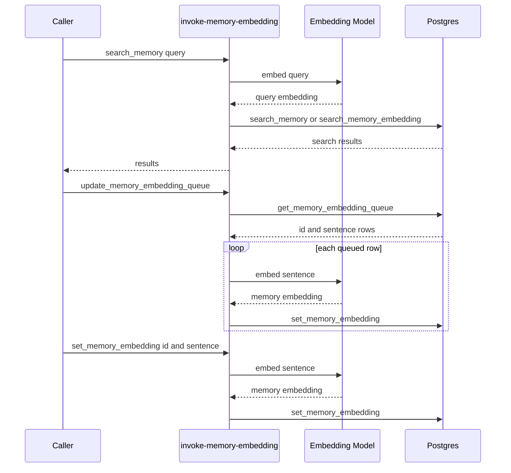

# Memory Requirements

The key words MUST, MUST NOT, SHOULD, SHOULD NOT, and MAY in this document are to be interpreted as described in RFC 2119 and RFC 8174 when, and only when, they appear in all capitals, as shown here.

## Scope

This document defines the current requirements for Memory: the enum vocabulary, the memory row shape, the `new_memory` RPC, the asynchronous embedding pipeline, the `invoke-memory-embedding` Edge Function, and the access control around them.

## Requirements

The system MUST store memories in a Postgres table named `public.memory`.

The `public.memory` table MUST represent one recorded memory per row.

The `public.memory` `CREATE TABLE` statement MUST declare an auto-generated primary key column named `id`.

The `public.memory` `CREATE TABLE` statement MUST declare a Unix epoch time column named `epoch`.

The `public.memory` `CREATE TABLE` statement MUST declare `entity`, `to_entity`, `relation`, `work`, `notes`, `notes_fts`, `active`, and `embedding`.

The `public.memory` `CREATE TABLE` statement MUST mark `entity`, `to_entity`, `relation`, `work`, `notes`, `notes_fts`, and `active` as not null.

The `embedding` column MAY be null while semantic embedding is pending.

The system MUST use `entity_enum` to identify actors and systems that can record or receive a memory row.

The `entity_enum` values MUST be case-sensitive on the wire.

The system MUST use `relation_enum` to identify the action performed by the recording entity.

The `relation_enum` values MUST support the sentence shape: `entity relation to_entity`.

The `relation_enum` values SHOULD be verbs.

The system MUST use `work_enum` to identify the work domain of a memory row.

The `work_enum` values MUST describe work domains, not project lore.

The system MUST use `invariant_enum` to represent non-negotiable operating rules as data.

The `invariant_enum` values MUST read as directives.

Positive invariant values MUST use the `DO_` prefix.

Negative invariant values MUST use the `DO_NOT_` prefix.

The system MUST NOT describe the `public.memory` table as graph-based unless graph storage or graph traversal behavior is added.

The system MUST NOT describe the `public.memory` table as append-only.

The system MUST expose an RPC function named `new_memory` for inserting a memory row.

The `new_memory` function MUST accept `entity`, `to_entity`, `relation`, `work`, and `notes` input values.

The `new_memory` function MUST insert the memory row before semantic embedding is required.

The system MAY generate embeddings after `new_memory` inserts the memory row.

The `new_memory` function MUST return the inserted row's `id`, `epoch`, `entity`, `to_entity`, `relation`, `work`, `notes`, and `active` values.

The `public.memory` `CREATE TABLE` statement MUST declare `notes_fts` as generated from `notes`.

The `new_memory` function MUST NOT accept `notes_fts` as an input value.

The `new_memory` function MUST rely on Postgres to populate `notes_fts`.

Semantic search MUST only use rows where `embedding` is not null.

The system MUST expose an Edge Function named `invoke-memory-embedding`.

The `invoke-memory-embedding` Edge Function MUST support a `search_memory` action.

The `invoke-memory-embedding` Edge Function MUST support an `update_memory_embedding_queue` action.

The `invoke-memory-embedding` Edge Function MUST support a `set_memory_embedding` action.

The `search_memory` action MUST generate an embedding for the incoming query.

The `search_memory` action MUST call `search_memory` for hybrid search.

The `search_memory` action MUST call `search_memory_embedding` for semantic-only search.

The `update_memory_embedding_queue` action MUST call `get_memory_embedding_queue`.

The `update_memory_embedding_queue` action MUST call `set_memory_embedding` for each queued memory row.

The `set_memory_embedding` action MUST require `id` and `sentence`.

The `set_memory_embedding` action MUST store one embedding for one memory row.

The `invoke-memory-embedding` Edge Function MUST execute its database calls as the `service_role`.

The `public`, `anon`, and `authenticated` roles MUST NOT execute `set_memory_embedding` directly.

The `public`, `anon`, and `authenticated` roles MUST NOT execute `start_memory_embedding` directly.

The `service_role` MUST be able to execute `set_memory_embedding`.

The `service_role` MUST be able to execute `search_memory`, `search_memory_embedding`, and `get_memory_embedding_queue`.

The `service_role` MUST be able to read rows from `public.memory`.

The `service_role` MUST be able to update the `embedding` of an existing `public.memory` row.

The `invoke-memory-embedding` Edge Function MUST reject any request whose `Authorization` bearer token is not the project service role key.

The `start_memory_embedding` trigger MUST present the project service role key when it calls the `invoke-memory-embedding` Edge Function.

## New Memory Flow

The caller submits `entity`, `to_entity`, `relation`, `work`, and `notes`.

The `new_memory` function inserts the memory row immediately.

Postgres generates `id`, `epoch`, and `notes_fts` during insert.

After the row is inserted, the `start_memory_embedding` trigger fires.

The trigger renders the canonical memory sentence with `convertto_memory_sentence`.

The trigger calls the `invoke-memory-embedding` Edge Function with the row `id` and the rendered sentence, presenting the project service role key.

The Edge Function embeds the sentence and stores the returned vector in the row's `embedding` column.

The memory row is available for direct lookup and full-text search before embedding is complete.

The memory row is available for semantic search after embedding is complete.

## Invoke Memory Embedding Flow

The `invoke-memory-embedding` Edge Function owns semantic enrichment and semantic search request handling.

The `search_memory` action embeds the query text before calling SQL search RPCs.

The `update_memory_embedding_queue` action backfills memory rows whose embedding is still missing.

The `set_memory_embedding` action embeds one supplied sentence and stores the returned vector for one memory row.

## Alternatives

### Require Embedding Before Insert

The system could require every caller to generate an embedding before calling `new_memory`.

This means the caller must build the memory payload, build the sentence to embed, call an embedding model, wait for the returned vector, and then call `new_memory` with the same memory payload plus the embedding.

This keeps `embedding` non-null, but it makes the core memory insert depend on an external model call.

This alternative is not preferred because recording memory should not be blocked by semantic enrichment.

### Insert First, Embed Later

The system can insert the memory row first and generate the embedding later.

This means `new_memory` records the memory immediately, Postgres generates `notes_fts` immediately, and an embedding worker fills `embedding` after the row exists.

This alternative is preferred because `embedding` is asynchronous enrichment, not core memory data.

### Default Placeholder Embedding

The system could make `embedding` not null by storing a default placeholder vector.

This alternative is not preferred because a placeholder vector makes invalid semantic data look valid.

This alternative is not preferred because semantic search would need to detect and ignore placeholder embeddings.

## Acceptance Criteria

Given the `public.memory` table definition,
When the column list is reviewed,
Then `id` is the primary key
And `epoch` is present as Unix epoch time
And `notes_fts` is present as a generated column.

Given the enum SQL files,
When enum values are reviewed,
Then no enum value requires prior knowledge of AgentMemory, EdgeGrammar, ThotBot, or Optimus Sharp.

Given the `relation_enum` SQL file,
When each value is read in the shape `entity relation to_entity`,
Then each value reads as an action performed by the recording entity.

Given the `work_enum` SQL file,
When each value is reviewed,
Then each value names a reusable work domain.

Given project documentation for the core table,
When the table is described,
Then the description does not use graph, append-only, governance, compliance, or ledger language.

Given a caller has `entity`, `to_entity`, `relation`, `work`, and `notes`,
When `new_memory` is called,
Then the memory row is inserted.

Given a caller has not generated an embedding,
When `new_memory` is called,
Then the insert succeeds
And the insert does not create a placeholder embedding.

Given `new_memory` inserts a memory row,
When the function returns,
Then the result includes `id` and `epoch`.

Given a caller has `notes`,
When `new_memory` is called,
Then the caller does not provide `notes_fts`
And Postgres generates `notes_fts` from `notes`.

Given the `anon` role,
When it calls `set_memory_embedding` directly,
Then the call is denied.

Given the `invoke-memory-embedding` Edge Function executing as the `service_role`,
When it calls `set_memory_embedding` for an existing memory row,
Then the call succeeds
And the row's `embedding` is no longer null.

Given a caller presenting the anon key as the `Authorization` bearer token,
When it calls any `invoke-memory-embedding` action,
Then the function responds 401
And performs no action.

Given a caller presenting the project service role key as the `Authorization` bearer token,
When it calls the `search_memory` action,
Then the function responds 200 with results.

## Open Questions

Is the `service_role` the write path for `new_memory`, requiring `INSERT` on `public.memory`,
or is insertion reserved for `authenticated` callers? The embedding and search paths do not require
`INSERT`; the current grant includes it.
