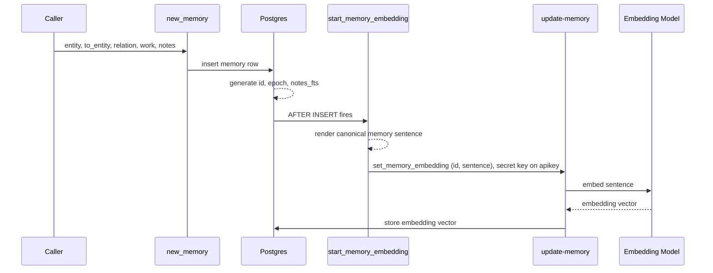
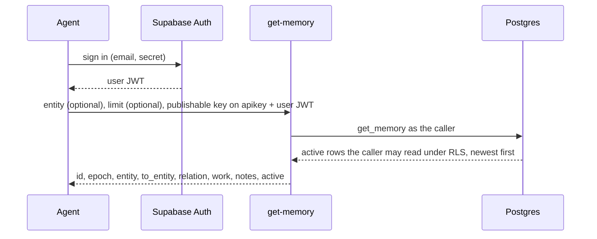
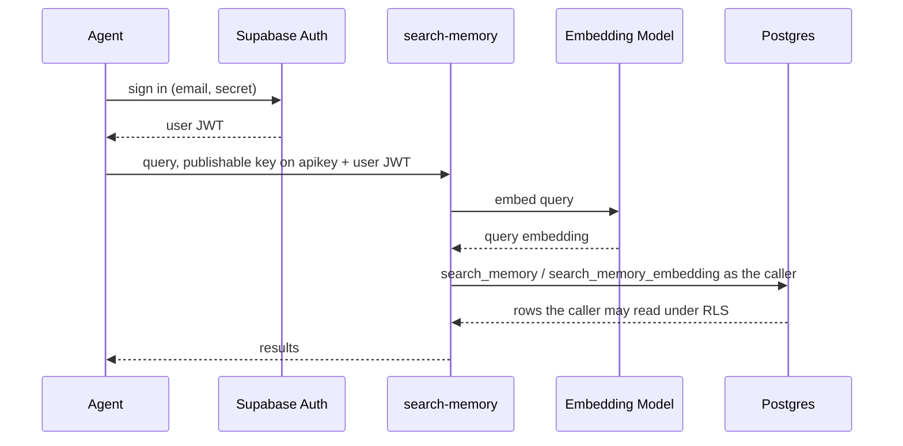
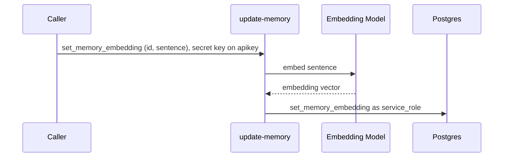

# Memory Requirements

# 1. Normative Language

> ## a. The key words MUST, MUST NOT, SHOULD, SHOULD NOT, and MAY in this document are to be interpreted as described in RFC 2119 and RFC 8174 when, and only when, they appear in all capitals, as shown here.

# 2. Scope

> ## a. This document defines the current requirements for Memory: the enum vocabulary, the memory row shape, the `new_memory` RPC, the `get_memory` retrieval RPC, the asynchronous embedding pipeline, the `update-memory` Edge Function, and the access control around them.

# 3. Memory Table

> ## a. The system MUST store memories in a Postgres table named `public.memory`.

> ## b. The `public.memory` table MUST represent one recorded memory per row.

> ## c. The `public.memory` `CREATE TABLE` statement MUST declare an auto-generated primary key column named `id`.

> ## d. The `public.memory` `CREATE TABLE` statement MUST declare a Unix epoch time column named `epoch`.

> ## e. The `public.memory` `CREATE TABLE` statement MUST declare `entity`, `to_entity`, `relation`, `work`, `notes`, `notes_fts`, `active`, and `embedding`.

> ## f. The `public.memory` `CREATE TABLE` statement MUST mark `entity`, `to_entity`, `relation`, `work`, `notes`, `notes_fts`, and `active` as not null.

> ## g. The `embedding` column MAY be null while semantic embedding is pending.

> ## h. The `public.memory` `CREATE TABLE` statement MUST declare `notes_fts` as generated from `notes`.

> ## i. The system MUST NOT describe the `public.memory` table as graph-based unless graph storage or graph traversal behavior is added.

> ## j. The system MUST NOT describe the `public.memory` table as append-only.

# 4. Enum Vocabulary

> ## a. The system MUST use `entity_enum` to identify actors and systems that can record or receive a memory row.

> ## b. The `entity_enum` values MUST be case-sensitive on the wire.

> ## c. The system MUST use `relation_enum` to identify the action performed by the recording entity.

> ## d. The `relation_enum` values MUST support the sentence shape: `entity relation to_entity`.

> ## e. The `relation_enum` values SHOULD be verbs.

> ## f. The system MUST use `work_enum` to identify the work domain of a memory row.

> ## g. The `work_enum` values MUST describe work domains, not project lore.

> ## h. The system MUST use `invariant_enum` to represent non-negotiable operating rules as data.

> ## i. The `invariant_enum` values MUST read as directives.

> ## j. Positive invariant values MUST use the `DO_` prefix.

> ## k. Negative invariant values MUST use the `DO_NOT_` prefix.

# 5. New Memory RPC

> ## a. The system MUST expose an RPC function named `new_memory` for inserting a memory row.

> ## b. The `new_memory` function MUST accept `entity`, `to_entity`, `relation`, `work`, and `notes` input values.

> ## c. The `new_memory` function MUST insert the memory row before semantic embedding is required.

> ## d. The system MAY generate embeddings after `new_memory` inserts the memory row.

> ## e. The `new_memory` function MUST return the inserted row's `id`, `epoch`, `entity`, `to_entity`, `relation`, `work`, `notes`, and `active` values.

> ## f. The `new_memory` function MUST NOT accept `notes_fts` as an input value.

> ## g. The `new_memory` function MUST rely on Postgres to populate `notes_fts`.

# 6. Get Memory RPC

> ## a. The system MUST expose an RPC function named `get_memory` for reading recorded memory rows.

> ## b. The `get_memory` function MUST accept an optional entity filter and an optional row limit.

> ## c. The `get_memory` function MUST default the entity filter to null and return rows for every entity when no entity is given.

> ## d. The `get_memory` function MUST default the row limit to 10.

> ## e. The `get_memory` function MUST return only rows where `active` is true.

> ## f. The `get_memory` function MUST order rows by `epoch` descending, then `id` descending, so the newest memory is the first row.

> ## g. The `get_memory` function MUST return each row's `id`, `epoch`, `entity`, `to_entity`, `relation`, `work`, `notes`, and `active` values.

> ## h. The `get_memory` function MUST run as the calling role so Row Level Security gates which rows it returns.

# 7. Search and Caller Authentication

> ## a. Semantic search MUST only use rows where `embedding` is not null.

> ## b. The system MUST identify each calling agent as a Supabase Auth user.

> ## c. A caller MUST present the publishable key on the `apikey` header and its user JWT on the `Authorization` header.

> ## d. The system MUST NOT require any client to hold the project secret key.

# 8. Search Memory Edge Function

> ## a. The system MUST expose a user-facing Edge Function named `search-memory`.

> ## b. The `search-memory` Edge Function MUST run as the calling user by forwarding the caller's JWT to PostgREST.

> ## c. The `search-memory` Edge Function MUST generate an embedding for the incoming query.

> ## d. The `search-memory` Edge Function MUST call `search_memory` for hybrid search.

> ## e. The `search-memory` Edge Function MUST call `search_memory_embedding` for semantic-only search.

# 9. Get Memory Edge Function

> ## a. The system MUST expose a user-facing Edge Function named `get-memory`.

> ## b. The `get-memory` Edge Function MUST run as the calling user by forwarding the caller's JWT to PostgREST.

> ## c. The `get-memory` Edge Function MUST call `get_memory` for direct retrieval.

> ## d. The `get-memory` Edge Function MUST accept an optional entity and an optional limit and forward them to `get_memory`.

# 10. Update Memory Edge Function

> ## a. The system MUST expose an internal Edge Function named `update-memory`.

> ## b. The `update-memory` Edge Function MUST authorize the caller by the project secret key presented on the `apikey` header.

> ## c. The `update-memory` Edge Function MUST run as `service_role` to write embeddings.

> ## d. The `update-memory` Edge Function MUST support a `set_memory_embedding` action that requires `id` and `sentence` and stores one embedding for one memory row.

> ## e. The `update-memory` Edge Function MUST support an `update_memory_embedding_queue` action that drains `get_memory_embedding_queue` and stores an embedding for each queued row.

# 11. Access Control

> ## a. Row Level Security MUST gate which rows the `authenticated` role can read and insert.

> ## b. The `authenticated` role MUST be able to execute `new_memory`, `get_memory`, `search_memory`, and `search_memory_embedding`.

> ## c. The `public` and `anon` roles MUST NOT read or write `public.memory`.

> ## d. The `set_memory_embedding` RPC MUST NOT be executable by the `public`, `anon`, or `authenticated` roles.

> ## e. The `start_memory_embedding` trigger MUST present the project secret key on the `apikey` header when it calls `update-memory`.

# 12. New Memory Flow

> ## a. The caller submits `entity`, `to_entity`, `relation`, `work`, and `notes`.

> ## b. The `new_memory` function inserts the memory row immediately.

> ## c. Postgres generates `id`, `epoch`, and `notes_fts` during insert.

> ## d. After the row is inserted, the `start_memory_embedding` trigger fires.

> ## e. The trigger renders the canonical memory sentence with `convertto_memory_sentence`.

> ## f. The trigger calls the `update-memory` Edge Function with the row `id` and the rendered sentence, presenting the project secret key on the `apikey` header.

> ## g. The Edge Function embeds the sentence and stores the returned vector in the row's `embedding` column.

> ## h. The memory row is available for direct lookup and full-text search before embedding is complete.

> ## i. The memory row is available for semantic search after embedding is complete.

# 13. Get Memory Flow

> ## a. The `get-memory` Edge Function owns direct retrieval.

> > ### i. It runs as the calling user by forwarding the user JWT, so Row Level Security decides which rows it returns.

> > ### ii. It calls `get_memory`, which reads recorded memory rows separate from full-text and semantic search.

> ## b. The caller MAY pass an entity to scope the read to one recording actor, or omit it to read across every entity.

> ## c. The caller MAY pass a limit, or omit it to take the default of 10.

> ## d. `get_memory` returns only rows where `active` is true, ordered newest first by `epoch` then `id`.

> ## e. Because the newest recorded memory is the first row returned, `get-memory` with no arguments is the grounding read for the latest activity across all entities.

# 14. Search Flow

> ## a. The `search-memory` Edge Function owns semantic search.

> > ### i. It runs as the calling user by forwarding the user JWT, so Row Level Security decides which rows the search returns.

> > ### ii. It embeds the query before calling the SQL search RPCs.

# 15. Update Flow

> ## a. The `update-memory` Edge Function owns embedding writes.

> > ### i. It authorizes the caller by the project secret key on the `apikey` header and runs as `service_role`.

> > ### ii. The `start_memory_embedding` trigger calls it per insert.

> > ### iii. The `update_memory_embedding_queue` action backfills rows whose embedding is still missing.

# 16. Alternatives

> ## a. Require Embedding Before Insert

> > ### i. The system could require every caller to generate an embedding before calling `new_memory`.

> > ### ii. This means the caller must build the memory payload, build the sentence to embed, call an embedding model, wait for the returned vector, and then call `new_memory` with the same memory payload plus the embedding.

> > ### iii. This keeps `embedding` non-null, but it makes the core memory insert depend on an external model call.

> > ### iv. This alternative is not preferred because recording memory should not be blocked by semantic enrichment.

> ## b. Insert First, Embed Later

> > ### i. The system can insert the memory row first and generate the embedding later.

> > ### ii. This means `new_memory` records the memory immediately, Postgres generates `notes_fts` immediately, and an embedding worker fills `embedding` after the row exists.

> > ### iii. This alternative is preferred because `embedding` is asynchronous enrichment, not core memory data.

> ## c. Default Placeholder Embedding

> > ### i. The system could make `embedding` not null by storing a default placeholder vector.

> > ### ii. This alternative is not preferred because a placeholder vector makes invalid semantic data look valid.

> > ### iii. This alternative is not preferred because semantic search would need to detect and ignore placeholder embeddings.

# 17. Deployment

> ## a. These are the conditions a valid deployment satisfies.

> > ### i. The ordered, click-by-click procedure lives in the project README.

> > ### ii. This section states what MUST hold, not the steps.

> ## b. The system MUST enable the `vector`, `pg_net`, and `supabase_vault` extensions.

> ## c. The `entity_enum`, `relation_enum`, and `work_enum` types are shared with the thot system.

> > ### i. Deployment MUST add missing values with `ALTER TYPE ... ADD VALUE` rather than recreate the types when they already exist.

> ## d. The SQL objects MUST be applied in dependency order: types, then the table and its policies, then the functions, then the grants, then the trigger.

> ## e. The `search-memory`, `get-memory`, and `update-memory` Edge Functions MUST be deployed with `verify_jwt` disabled, because each function authorizes its own caller.

> ## f. The Vault MUST hold the project URL and the project secret key that the `start_memory_embedding` trigger reads.

> ## g. After data is restored, embeddings for rows where `embedding` is null MUST be backfilled through the `update-memory` `update_memory_embedding_queue` action.

# 18. Acceptance Criteria

> ## a. Memory Table Definition

> > ### i. Given the `public.memory` table definition,

> > ### ii. When the column list is reviewed,

> > ### iii. Then `id` is the primary key

> > ### iv. And `epoch` is present as Unix epoch time

> > ### v. And `notes_fts` is present as a generated column.

> ## b. Enum Independence

> > ### i. Given the enum SQL files,

> > ### ii. When enum values are reviewed,

> > ### iii. Then no enum value requires prior knowledge of AgentMemory, EdgeGrammar, ThotBot, or Optimus Sharp.

> ## c. Relation Sentence Shape

> > ### i. Given the `relation_enum` SQL file,

> > ### ii. When each value is read in the shape `entity relation to_entity`,

> > ### iii. Then each value reads as an action performed by the recording entity.

> ## d. Work Domain Reuse

> > ### i. Given the `work_enum` SQL file,

> > ### ii. When each value is reviewed,

> > ### iii. Then each value names a reusable work domain.

> ## e. Core Table Documentation

> > ### i. Given project documentation for the core table,

> > ### ii. When the table is described,

> > ### iii. Then the description does not use graph, append-only, governance, compliance, or ledger language.

> ## f. New Memory Insert

> > ### i. Given a caller has `entity`, `to_entity`, `relation`, `work`, and `notes`,

> > ### ii. When `new_memory` is called,

> > ### iii. Then the memory row is inserted.

> ## g. Insert Without Embedding

> > ### i. Given a caller has not generated an embedding,

> > ### ii. When `new_memory` is called,

> > ### iii. Then the insert succeeds

> > ### iv. And the insert does not create a placeholder embedding.

> ## h. New Memory Return Values

> > ### i. Given `new_memory` inserts a memory row,

> > ### ii. When the function returns,

> > ### iii. Then the result includes `id` and `epoch`.

> ## i. Generated Full-Text Search Value

> > ### i. Given a caller has `notes`,

> > ### ii. When `new_memory` is called,

> > ### iii. Then the caller does not provide `notes_fts`

> > ### iv. And Postgres generates `notes_fts` from `notes`.

> ## j. Anonymous Role Denial

> > ### i. Given the `anon` role,

> > ### ii. When it tries to read or write `public.memory`,

> > ### iii. Then Row Level Security denies it.

> ## k. Authenticated New Memory Insert

> > ### i. Given a signed-in agent presenting the publishable key and its user JWT,

> > ### ii. When it calls `new_memory`,

> > ### iii. Then the row is inserted under the `authenticated` role.

> ## l. Authenticated Search Memory Call

> > ### i. Given a signed-in agent presenting the publishable key and its user JWT,

> > ### ii. When it calls the `search-memory` Edge Function,

> > ### iii. Then the function runs as that user

> > ### iv. And returns only rows the user may read under Row Level Security.

> ## m. Authorized Embedding Update

> > ### i. Given a caller presenting the project secret key on the `apikey` header,

> > ### ii. When it calls the `update-memory` `set_memory_embedding` action for an existing row,

> > ### iii. Then the call succeeds

> > ### iv. And the row's `embedding` is no longer null.

> ## n. Unauthorized Embedding Update

> > ### i. Given a caller that does not present the project secret key,

> > ### ii. When it calls `update-memory`,

> > ### iii. Then the function responds 401

> > ### iv. And performs no action.

> ## o. Default Get Memory Call

> > ### i. Given no arguments,

> > ### ii. When `get_memory` is called,

> > ### iii. Then it returns the most recent rows the caller may read under Row Level Security

> > ### iv. And the rows are ordered newest first

> > ### v. And at most 10 rows are returned.

> ## p. Entity-Filtered Get Memory Call

> > ### i. Given an entity argument,

> > ### ii. When `get_memory` is called,

> > ### iii. Then it returns only rows recorded by that entity

> > ### iv. And only rows where `active` is true.

> ## q. Authenticated Get Memory RPC Call

> > ### i. Given a signed-in agent presenting the publishable key and its user JWT,

> > ### ii. When it calls `get_memory`,

> > ### iii. Then the function runs under the `authenticated` role

> > ### iv. And returns only rows the user may read under Row Level Security.

> ## r. Authenticated Get Memory Edge Function Call

> > ### i. Given a signed-in agent presenting the publishable key and its user JWT,

> > ### ii. When it calls the `get-memory` Edge Function with no arguments,

> > ### iii. Then the function runs as that user

> > ### iv. And returns at most 10 rows the user may read under Row Level Security, newest first.
